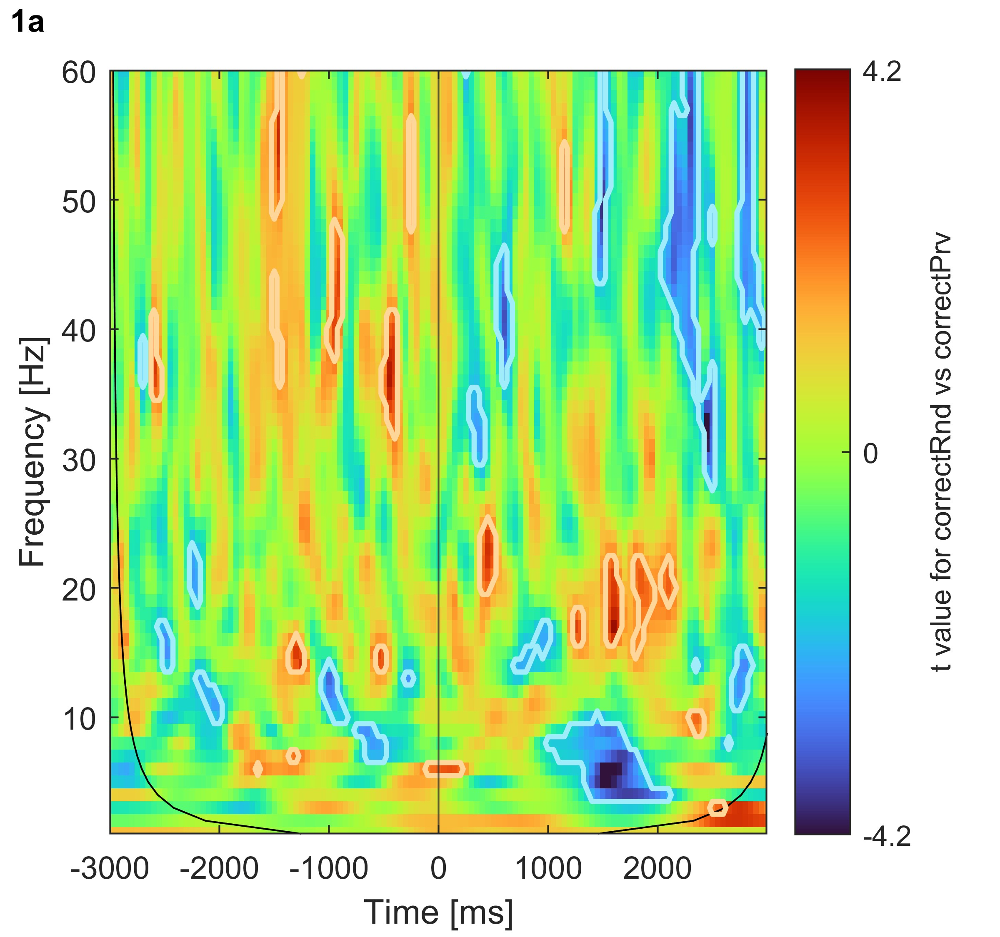

class: center, middle

## SPREO explorations

.footnote[
On a Windows device:
- press F11 to go full screen
- on an image, right-click "open image in new tab" to zoom in on it or save it
]

---

# Measures:

- total power, referred to as just "**power**", computed at the trial level, then averaged across trials separately per session.
- evoked power, referred to as **evoked power** (!) computed on the ensemble-average time-domain (i.e., on the ERP waveform)

--

All power values extracted as the magnitude squared of the complex-valued coefficients obtained through cwt (continuous wavelet transform) using Morse wavelets with parameters gamma = 3 and beta = 20. These parameters favor frequency precision over temporal precision.

--

.footnote[
I reduced the temporal resolution _after_ cwt to either 50 Hz (equivalent to averaging values within in 50 bins per second, when analyzing the [-500 500] ms window) or 20 Hz (20 bins, when analyzing the [-3000 3000] ms window). This is common practice and still represents greater temporal resolution than long 400-ms.
]

---

class: center, middle

## statistical descriptives

.footnote[
ensemble average = mean across trials    
]
---

# [-500, 500] ms power around response (0 ms = incorrect response)

.left-column-66[

]

.right-column-33[
On a descriptive level, two patterns:
- near-alpha activity before the response
- theta-delta activity around the response 

These patterns appear either before or during an error. But how specific to error making are they?

]

---

# [-3000, 3000] ms power around response (0 ms = incorrect response)

.left-column-66[

]

.right-column-33[
In the longer epoch (spanning multiple trials before and after the error):
- the theta-delta activity is visible only around the error
- the near-alpha activity appears intermittently (post stimulus)

Perhaps, the near-alpha activity occurs after any stimulus. Perhaps it appears before any response (be it an error or not).

]

---

# [-3000, 3000] ms evoked power around response (0 ms = incorrect response)

.left-column-66[

]

.right-column-33[
Evoked-power shows the two patterns, but near-alpha activity is now much less evident relative to the theta-delta activity.

Possible interpretation: the theta-delta pattern is phase locked to the error, whereas the near-alpha pattern is not. Not unexpected.
]

---

class: center, middle

## statistical inference

---

# testing the association between cwt EEG and mean ERN

Monte-Carlo permutation testing (5000 iterations) based on statistical scores (e.g., correlations, t-test scores depending on the analysis) to obtain an empirical p-value at each time-frequency point (or "pixel" like most people like to call it when considering a time-frequency matrix). Binary approach: significant (p < 0.05) or not.

--

Analysis set 1. Pearson correlations between mean ERN and each time-frequency point (or "pixel") across participants, separately per session-block.

Analysis set 2. Paired-sample t-test at each time-frequency point (or "pixel") comparing incorrect vs correct trials

--

Some participants don't have data for a certain session-block combination (did not make enough errors in that session-block). So, they are excluded from the analysis on that session-block combination only.

--

Multiple-testing inflation of false discoveries not controlled for now. At a later point, cluster correction can be applied. Therefore, the current analyses _can show many significant time-frequency results which would be washed out by multiple-testing correction_. This exercise is purely _exploratory_ for now.

---

class: center, middle

## statistical inference
### Analysis set 1

---

# mean ERN : [-500, 500] ms power (session-block 1a)

.left-column-66[

]

.right-column-33[

A negative correlation indicates that a _more negative_ ERN (i.e., larger ERN mean amplitude) is associated with greater power in that specific time-frequency point.

Subjects with greater theta-delta activity and near-alpha activity(and beyond) have a larger ERN.
]

---

# mean ERN : [-3000, 3000] ms power (session-block 1a)

.left-column-66[

]

.right-column-33[
With an intertrial interval of ca. 1.5 s (more or less?), the near-alpha effect stretches not only into trials _before_ the error but even into those _after_ the error. 

.small-text[
(Speculation alert) What does it mean? 
The near-alpha pattern is unlikely to be specific to error-making. It could reflect the mobilization of resources towards the processing of the stimulus. The negative association effect could indicate that individuals with greater near-alpha power, allocate more resources to the task, and therefore _when they make an error_, their ERN is larger.
]
]

---

class: center, middle

## statistical inference
### Analysis set 2

---

# Trial selection

    

Two approaches to correct trial selection.

--

**'correctRnd'**. Correct trials **chosen randomly** with the contrain of being in the same number of incorrect trials, per session-block.

--

**'correctPrv'**. For each incorrect trial, take the **trial before**. But identify instances where:
- the previous trial was also incorrect (i.e., a train of multiple incorrect trials) 
- the first trial of the session-block was incorrect (so no previous trial)

Remove those (vey rare) instances, and replace them with randomly chosen correct trials belonging to the same session-block

---

# t-tests [-3000, 3000] ms power (session-block 1a), incorrect vs correctRnd

.left-column-66[

]

.right-column-33[
Interpretation: the peri-error theta-delta activity is larger for incorrect trials than correct (random approach).

The effect includes the theta-delta range (and it's probably maximal at theta) but it's not limited to these frequencies.

There is some other stuff that might be interesting, or might just be "false discovery"

]

---

# t-tests [-3000, 3000] ms power (session-block 1a), incorrect vs correctPrv

.left-column-66[

]

.right-column-33[
interpretation: same when comparing incorrect vs correctPrv.

Probably this is a better approach because, by using neighboring trials, it minimizes differences in temporary attentional drifts

]

---

# t-tests [-3000, 3000] ms power (session-block 1a), correctRnd vs correctPrv

.left-column-66[

]

.right-column-33[
Interpretation: unsure. No major difference at the time of committing an error.
]

---

only session-block 1a for now

to be continued...