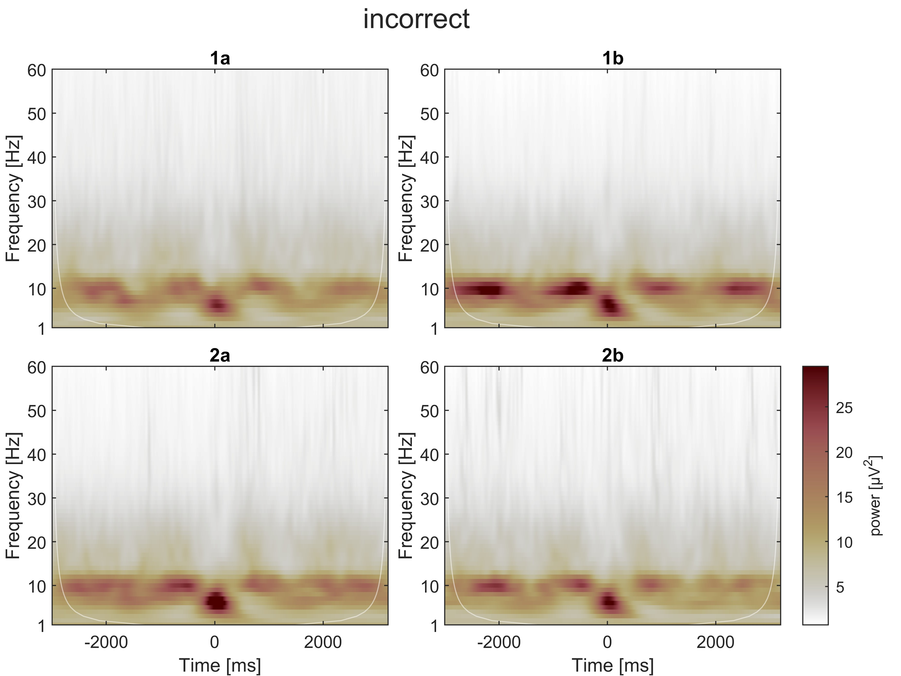

class: center, middle

## SPREO explorations

.footnote[
On a Windows device:
- press F11 to go full screen
- on an image, right-click "open image in new tab" to zoom in on it or save it
]

---

# Measures:

- total power, referred to as just "**power**", computed at the trial level, then averaged across trials separately per session.
- evoked power, referred to as **evoked power** (!) computed on the ensemble-average time-domain (i.e., on the ERP waveform)

--

All power values extracted as the magnitude squared of the complex-valued coefficients obtained through cwt (continuous wavelet transform) using Morse wavelets with parameters gamma = 3 and beta = 20

---

class: center, middle

## statistical descriptives (mean values)

---

# [-500, 500] ms power around response (0 ms = incorrect response)

.left-column-66[

]

.right-column-33[
On a descriptive level, two patterns:
- near-alpha activity before the response
- theta-delta activity around the response 

These patterns appear either before or during an error. But how specific to error making are they?

]

---

# [-3000, 3000] ms power around response (0 ms = incorrect response)

.left-column-66[

]

.right-column-33[
In the longer epoch (spanning multiple trials before and after the error):
- the theta-delta activity is visible only around the error
- the near-alpha activity appears intermittently (post stimulus)

Perhaps, the near-alpha activity occurs after any stimulus. Perhaps it appears before any response (be it an error or not).

]

---

# [-3000, 3000] ms evoked power around response (0 ms = incorrect response)

.left-column-66[

]

.right-column-33[
Evoked-power shows the two patterns, but near-alpha activity is now much less evident relative to the theta-delta activity.

Possible interpretation: the theta-delta pattern is phase locked to the error, whereas the near-alpha pattern is not
]

---

class: center, middle

## statistical inference

---

# testing the association between cwt EEG and mean ERN

#### Analysis details

Monte-Carlo permutation testing based on Pearson correlations. Correlations were computed between mean ERN and each time-frequency "pixel" across participants, separately per session-block.

--

Monte-Carlo iterations (5000) conducted at the pixel level to obtain empirical uncorrected p values. The analyses will only highlight p < 0.05 results.

--

Some participants don't have data for a certain session-block combination. They are excluded from the analysis on that session-block combination only.

--

Multiple-testing inflation of false discoveries not controlled for now. At a later point, cluster correction can be applied. Therefore, the current analyses can show many significant time-frequency results which would be washed out by multiple-testing correction. This exercise is purely _exploratory_ for now.

---

# mean ERN : [-500, 500] ms power (session 1a)

---

# mean ERN : [-3000, 3000] ms power (session 1a)

---

# mean ERN : [-3000, 3000] ms evoked power (session 1a)