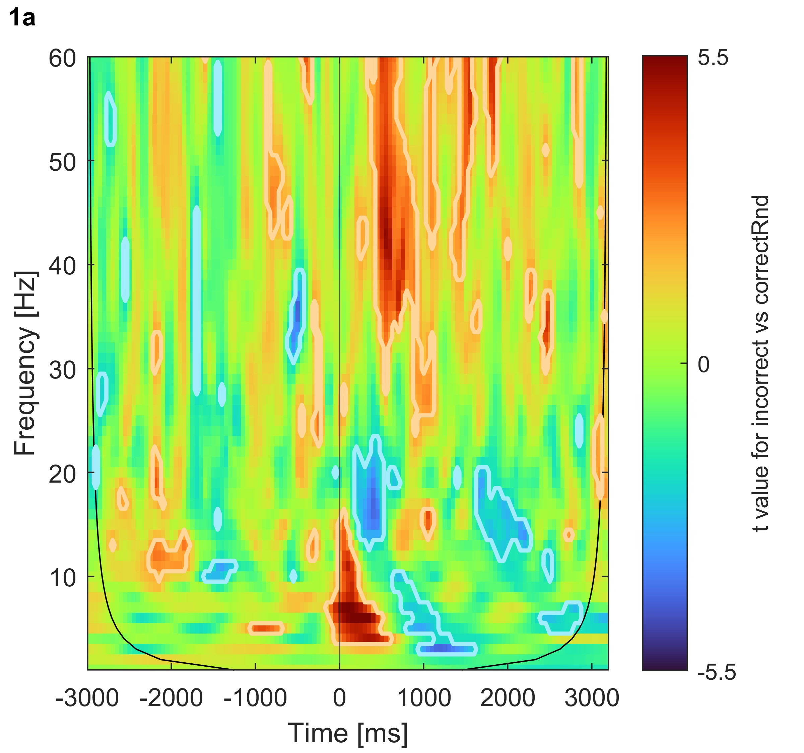

class: center, middle

## SPREO explorations

.footnote[
On a Windows device:
- press F11 to go full screen
- on an image, right-click "open image in new tab" to zoom in on it or save it
]

---

# Measures:

- total power, referred to as just "**power**", computed at the trial level, then averaged across trials separately per session.
- evoked power, referred to as **evoked power** (!) computed on the ensemble-average time-domain (i.e., on the ERP waveform)

--

All power values extracted as the magnitude squared of the complex-valued coefficients obtained through cwt (continuous wavelet transform) using Morse wavelets with parameters gamma = 3 and beta = 20. These parameters favor frequency precision over temporal precision.

--

.footnote[
I reduced the temporal resolution _after_ cwt to either 50 Hz (equivalent to averaging values within in 50 bins per second, when analyzing the [-500 500] ms window) or 20 Hz (20 bins, when analyzing the [-3000 3000] ms window). This is common practice and still represents greater temporal resolution than long 400-ms.
]

---

# Total power

A continuous wavelet transform (cwt) was applied to the long epoch (i.e., [-3, 3] s) time-domain signal on individual trials using jLab (v. 1.7.3, https://github.com/jonathanlilly/jLab). The transform used 60 Morse wavelets (gamma = 3, beta = 20, bandpass scaling; Lilly & Olhede, 2008; Olhede & Walden, 2002) with central frequencies linearly spaced from 1 to 60 Hz.

Power was computed as the squared modulus of each complex-valued wavelet coefficient in units of µV^2, then averaged across trials, separately per session-block.

(For Henrico's analyses only) Power was then averaged across all session-blocks for which we had data (few participants had all 4 session-blocks) and then further averaged in time-frequency ROIs

---

class: center, middle

## statistical descriptives

.footnote[
ensemble average = mean across trials    
]
---

# [-600, 425] ms power around response (0 ms = incorrect response)

.left-column-66[

]

.right-column-33[
On a descriptive level, two patterns:
- near-alpha activity before the response
- theta-delta activity around the response 

These patterns appear either before or during an error. But how specific to error making are they?

]

---

# [-3000, 3000] ms power around response (0 ms = incorrect response)

.left-column-66[

]

.right-column-33[
In the longer epoch (spanning multiple trials before and after the error):
- the theta-delta activity is visible only around the error
- the near-alpha activity appears intermittently (post stimulus)

Perhaps, the near-alpha activity occurs after any stimulus. Perhaps it appears before any response (be it an error or not).

]

---

# [-3000, 3000] ms evoked power around response (0 ms = incorrect response)

.left-column-66[

]

.right-column-33[
Evoked-power shows the two patterns, but near-alpha activity is now much less evident relative to the theta-delta activity.

Possible interpretation: the theta-delta pattern is phase locked to the error, whereas the near-alpha pattern is not. Not unexpected.
]

---

class: center, middle

## statistical inference

---

# testing the association between cwt EEG and mean ERN

Monte-Carlo permutation testing (5000 iterations) based on statistical scores (e.g., correlations, t-test scores depending on the analysis) to obtain an empirical p-value at each time-frequency point (or "pixel" like most people like to call it when considering a time-frequency matrix). Binary approach: significant (p < 0.05) or not.

--

Analysis set 1. Pearson correlations between mean ERN and each time-frequency point (or "pixel") across participants, separately per session-block.

Analysis set 2. Paired-sample t-test at each time-frequency point (or "pixel") comparing incorrect vs correct trials

--

Some participants don't have data for a certain session-block combination (did not make enough errors in that session-block). So, they are excluded from the analysis on that session-block combination only.

--

Multiple-testing inflation of false discoveries not controlled for now. At a later point, cluster correction can be applied. Therefore, the current analyses _can show many significant time-frequency results which would be washed out by multiple-testing correction_. This exercise is purely _exploratory_ for now.

---

class: center, middle

## statistical inference
### Analysis set 1

---

# mean ERN : [-600, 425] ms power (session-block 1a)

.left-column-66[

]

.right-column-33[

A negative correlation indicates that a _more negative_ ERN (i.e., larger ERN mean amplitude) is associated with greater power in that specific time-frequency point.

Subjects with greater theta-delta activity and near-alpha activity(and beyond) have a larger ERN.
]

---

# mean ERN amplitude : [-3000, 3000] ms power (session-block 1a)

.left-column-66[

]

.right-column-33[
With an intertrial interval of ca. 1.5 s (more or less?), the near-alpha effect stretches not only into trials _before_ the error but even into those _after_ the error. 

.small-text[
(Speculation alert) What does it mean? 
The near-alpha pattern is unlikely to be specific to error-making. It could reflect the mobilization of resources towards the processing of the stimulus. The negative association effect could indicate that individuals with greater near-alpha power, allocate more resources to the task, and therefore _when they make an error_, their ERN is larger.
]
]

---

Is this association _stable_ across session-blocks? 

--
Short answer: **no**.

The next slide will show how this association becomes more and more localized to just peri-error delta-theta.

---

# mean ERN amplitude : [-3000, 3000] ms power (all sessions)

.quadrant-2[
    

            
    

]

.quadrant-1[
    

            
    

]

.quadrant-3[
    

            
    

]

.quadrant-4[
    

        
    

]

---

# mean Pe amplitude : [-3000, 3000] ms power (all sessions)

not yet done

---

# Three approaches to correct trial selection.

    

--

.small-text[
**'correctRnd'**. Correct trials **chosen randomly** with the contrain of being in the same number of incorrect trials, per session-block.
]

--

.left-column[
.small-text[
**'correctPrv'**. For each incorrect trial, take the **trial before**. But identify instances where (1) the previous trial was also incorrect (i.e., a train of multiple incorrect trials) or (2) the first trial of the session-block was incorrect (so no previous trial) 
...and remove those instances, and replace them with randomly chosen correct trials belonging to the same session-block and **(18 Sep addition)** not occurring after an error
]
]

--

.right-column[
.small-text[
**'correctPst'**. For each incorrect trial, take the **trial after**. But identify instances where (1) the following trial was also incorrect (i.e., a train of multiple incorrect trials) or (2) the last trial of the session-block was incorrect (so no previous trial) 
...and remove those instances, and replace them with randomly chosen correct trials belonging to the same session-block and not occurring before an error
]
]

--

.footnote[
alternating incorrect trials mess up the Prv vs Pst split (e.g., C C I C I C C) where a correct trial is _both before and after_ an incorrect trial. Currently this type of correct trials are in both Prv and Pst.
]

---

# Example of trial classification for each session-block

.small-text[
The horizontal axis shows trials within a session-block, 2a in this example.

The vertical axis shows types of trials. Incorrect trials are shown with a purple cross. Above and below are correct trials that, respectively, followed and preceded an incorrect trial.

Notice how a correct trial can _both precede and follow_ an incorrect trials. Making the previous vs following split less clear-cut than ideal. 
]

---

# [-3000, 3000] ms power around response (0 ms = response)

.quadrant-2[
    

            
    

]

.quadrant-1[
    

            
    

]

.quadrant-3[
    

            
    

]

.quadrant-4[
    

        
    

]

---

class: center, middle

## statistical inference
### Analysis set 2

---

# t-tests [-3000, 3000] ms power (session-block 1a), incorrect vs correctRnd

.left-column-66[

]

.right-column-33[
Interpretation: the peri-error theta-delta activity is larger for incorrect trials than correct (correctRnd).

The effect includes the theta-delta range (and it's probably maximal at theta) but it's not limited to these frequencies.

There is some other stuff that might be interesting, or might just be "false discovery".

.small-text[
Let's compare these effects across sessions (next slide). The peri-error theta-delta activity is a constant, so is a beta-ish effect.
]

]

---

# t-tests [-3000, 3000] ms power (all session-blocks), incorrect vs correctRnd

.quadrant-2[
    

            
    

]

.quadrant-1[
    

            
    

]

.quadrant-3[
    

            
    

]

.quadrant-4[
    

        
    

]

---

# t-tests [-3000, 3000] ms power (all session-blocks), incorrect vs correctPrv

.quadrant-2[
    

            
    

]

.quadrant-1[
    

            
    

]

.quadrant-3[
    

            
    

]

.quadrant-4[
    

        
    

]

---

In the previous slide, something happens about 1.5 seconds... 
Should we get excited about the blue blob that follows the red one? 

--
In my opinion, no. 

--

Reason.: This analysis compares epochs locked to an error with epochs locked to correctPrv, that is correct responses _before_ an error (i.e., an error will be made ca 1.5 s later).

The epochs locked to errors show greater peri-error delta-theta (red blob). 

The epochs not locked to errors will have an error ca. 1.5 s later (blue blob). The blue blob is the transposed version of the red blob, that's all.

--

In other words, both "incorrect" and "correctPrv" epochs include an error, either a 0 s or ca. 1.5 s.

--

Additional evidence for this interpretation in the next slide: the blue blob sorts of appears at -1.5 s when comparing epochs locked to an error with epochs locked to correct responses _after_ an error (i.e., an error was be made ca 1.5 s before).

---

# t-tests [-3000, 3000] ms power (all session-blocks), incorrect vs correctPst

.quadrant-2[
    

            
    

]

.quadrant-1[
    

            
    

]

.quadrant-3[
    

            
    

]

.quadrant-4[
    

        
    

]

---

# t-tests [-3000, 3000] ms power (all session-blocks), correctPst vs correctPrv

.quadrant-2[
    

            
    

]

.quadrant-1[
    

            
    

]

.quadrant-3[
    

            
    

]

.quadrant-4[
    

        
    

]

---

In the previous slide, you can see that when comparing epochs locked to correct responses _after_ an error (i.e., an error will be made ca 1.5 s before) with epochs locked to correct responses _before_ an error (i.e., an error will be made ca 1.5 s later), the same two transposed blobs appear at once, at -1.5 s and +1.5 s.

--

We need to zoom in to see something more meaningful (next slide). But keep in mind, the current cwt parameter (beta = 20) is not great for temporal precision especially in the lower frequencies.

--

Long story short: post-error trials show lower alpha mainly before the response (or equivalently after the stimulus). You can notice it in the previous slide too.

--

A study showing a similar alpha power decrease after missing a golf putt (a motor error) http://doi.org/10.1111/psyp.12414
1. Generally, people put in more resources in trials following an error
2. Generally, lower alpha power indicates release from neuronal inhibition (more resources)

---

# t-tests [-3000, 3000] ms power (all session-blocks), correctPst vs correctPrv

.quadrant-2[
    

            
    

]

.quadrant-1[
    

            
    

]

.quadrant-3[
    

            
    

]

.quadrant-4[
    

        
    

]

