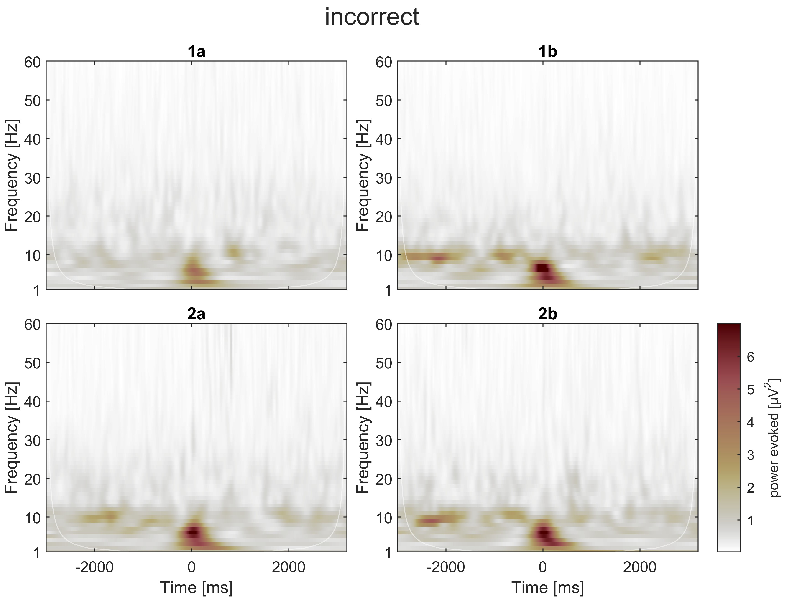
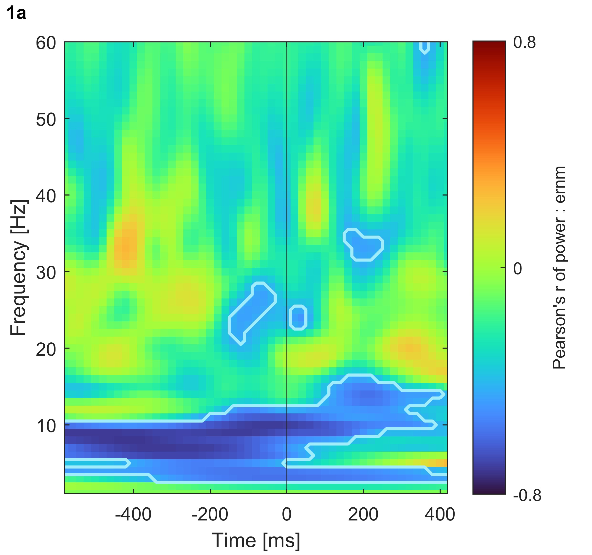

class: center, middle

## SPREO explorations

.footnote[
On a Windows device:
- press F11 to go full screen
- on an image, right-click "open image in new tab" to zoom in on it or save it
]

---

# Measures:

- total power, referred to as just "**power**", computed at the trial level, then averaged across trials separately per session.
- evoked power, referred to as **evoked power** (!) computed on the ensemble-average time-domain (i.e., on the ERP waveform)

--

All power values extracted as the magnitude squared of the complex-valued coefficients obtained through cwt (continuous wavelet transform) using Morse wavelets with parameters gamma = 3 and beta = 20. These parameters favor frequency precision over temporal precision.

.footnote[
I reduced the temporal resolution _after_ cwt to either 50 Hz (equivalent to averaging values within in 50 bins per second, when analyzing the [-500 500] ms window) or 20 Hz (20 bins, when analyzing the [-3000 3000] ms window). This is common practice and still represents greater temporal resolution than long 400-ms 
]

---

class: center, middle

## statistical descriptives (mean values)

---

# [-500, 500] ms power around response (0 ms = incorrect response)

.left-column-66[

]

.right-column-33[
On a descriptive level, two patterns:
- near-alpha activity before the response
- theta-delta activity around the response 

These patterns appear either before or during an error. But how specific to error making are they?

]

---

# [-3000, 3000] ms power around response (0 ms = incorrect response)

.left-column-66[

]

.right-column-33[
In the longer epoch (spanning multiple trials before and after the error):
- the theta-delta activity is visible only around the error
- the near-alpha activity appears intermittently (post stimulus)

Perhaps, the near-alpha activity occurs after any stimulus. Perhaps it appears before any response (be it an error or not).

]

---

# [-3000, 3000] ms evoked power around response (0 ms = incorrect response)

.left-column-66[

]

.right-column-33[
Evoked-power shows the two patterns, but near-alpha activity is now much less evident relative to the theta-delta activity.

Possible interpretation: the theta-delta pattern is phase locked to the error, whereas the near-alpha pattern is not. Not unexpected.
]

---

class: center, middle

## statistical inference

---

# testing the association between cwt EEG and mean ERN

Monte-Carlo permutation testing (5000 iterations) based on statistical scores (e.g., correlations, t-test scores depending on the analysis) to obtain an empirical p-value at each time-frequency point (or "pixel" like most people like to call it when considering a time-frequency matrix). Binary approach: significant (p < 0.05) or not.

--

Analysis set 1. Pearson correlations between mean ERN and each time-frequency point (or "pixel") across participants, separately per session-block.

Analysis set 2. Paired-sample t-test at each time-frequency point (or "pixel") comparing incorrect vs correct trials

--

Some participants don't have data for a certain session-block combination (did not make enough errors in that session-block). So, they are excluded from the analysis on that session-block combination only.

--

Multiple-testing inflation of false discoveries not controlled for now. At a later point, cluster correction can be applied. Therefore, the current analyses can show many significant time-frequency results which would be washed out by multiple-testing correction. This exercise is purely _exploratory_ for now.

---

# mean ERN : [-500, 500] ms power (session 1a)

.left-column-66[

]

.right-column-33[

A negative correlation indicates that a _more negative_ ERN (i.e., greater ERN mean amplitude) is associated with greater power in that specific time-frequency point.

Interpretation: ...
]

---

# mean ERN : [-3000, 3000] ms power (session 1a)

.left-column-66[

]

.right-column-33[

Interpretation: ...
]

---

# t-tests