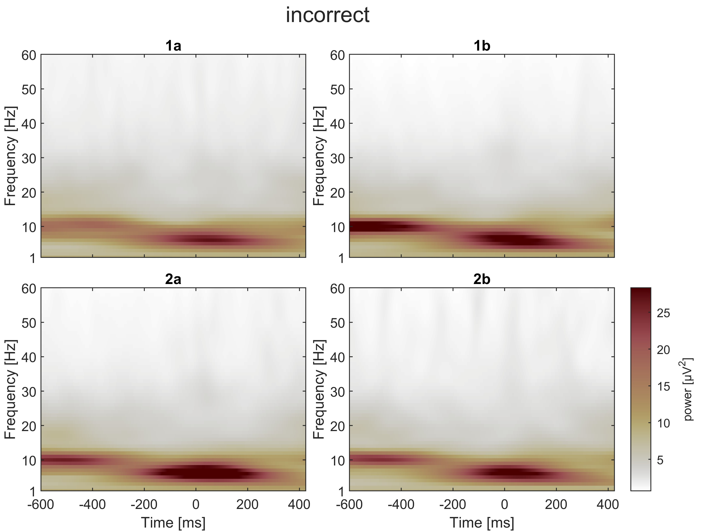
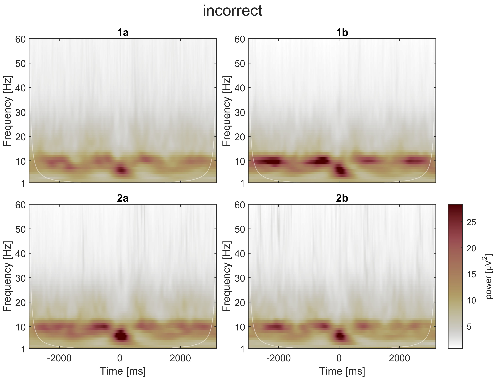

class: center, middle
name: intro

## SPREO explorations

.footnote[
On a Windows device:
- press F11 to go full screen
- on an image, right-click "open image in new tab" to zoom in on it or save it
]

---

# Measures:

- total power, referred to as just "**power**", computed at the trial level, then averaged across trials separately per session.
- evoked power, referred to as **evoked power** (!) computed on the ensemble-average time-domain (i.e., on the ERP waveform)

All power values extracted as the magnitude squared of the complex-valued coefficients obtained through cwt (continuous wavelet transform) using Morse wavelets with parameters gamma = 3 and beta = 20

---

# [-500, 500] ms power around response (0 ms = incorrect response)

.left-column-66[

]

--

.right-column-33[
On a qualitative level, two visual trends:
- near-alpha activity before the response
- theta-delta activity around the response 

Objective: understand these patterns' association with error (e.g., error processing, impaired activity leading to making an error).

]

---

# [-3000, 3000] ms power around response (0 ms = incorrect response)

.left-column-66[

]

.right-column-33[
In the longer epoch (spanning multiple trials before and after the error):
- the theta-delta activity is visible only around the error
- the near-alpha activity appears intermittently (post stimulus)

Perhaps, the near-alpha activity occurs after any stimulus. Perhaps it appears before any response (be it an error or not).

]

---

# [-3000, 3000] ms evoked power around response (0 ms = incorrect response)

